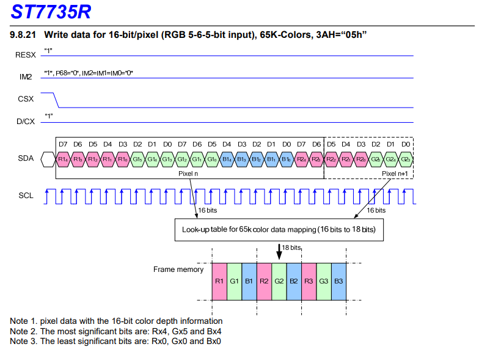

# 1. 概要
Raspberry PiにTFT Display ControllerをSPI接続して、ディスクトップ画面を出力する方法について説明する。  
CPLDには「[SPI_Mode(RasPi)_FPGA](../Firmware/SPI_Mode(RasPi)_FPGA)」のpofファイルを書き込んでおく。  
RasPi2B及びRasPi3Bにて動作確認済み。

# 2. RasPiとコントローラボードの接続
以下のように接続する。

| RasPi GPIO      | コントローラボード(P4) |
|:----------------|:-------------|
| 1: 3.3V         | 29: 3V3      |
| 2: 5V           | 11: LED      |
| 6: GND          | 12: GND      |
| 19: SPI_MOSI    | 6: SPI_MOSI  |
| 23: SPI_CLK     | 4: SPI_CLK   |
| 24: SPI_CE0_N   | 2: SPI_CS    |


# 3. Raspbianのインストール
RasPiのOSにはメジャーなRaspbianを使用した。[こちら](https://www.raspberrypi.org/downloads/raspbian/)からDLできる。  
ホストマシンがLinuxであれば、適当な場所に解凍して以下コマンドでSDにコピーすればインストール完了。  
```  
# dd bs=4M if=2019-07-10-raspbian-buster-full.img of=/dev/sdX conv=fsync
```
sdXにはSDカードのデバイス名を指定する（例: sdb）。予め以下コマンドでディスク情報を確認しておくと良い。  
```  
# fdisk sdX
```
動作検証で使用したバージョンは以下のとおり。  
* FileName: 2019-07-10-raspbian-buster-full.img
* Release date: 2019-07-10
* Kernel version: 4.19

# 4. Raspbianの設定
## 4.1. 基本設定
（※詳しくは適宜ググってください）
### SSHの設定
リモートで作業出来たほうが色々と便利なので、SSH Serverを有効にしておく。  
（なお、予めSDカードのbootディレクトリ直下に"ssh"という名前の空ファイルを配置しておけば、SSH Serverが有効状態で起動するらしい。この方法だとHDMI接続のディスプレイなしでTFTディスプレイに映像を出せる）  
raspi-config  
```
5 Interfacing Options -> P2 SSH -> enable
```
### 画面設定
周囲の黒フチ表示を解除する。  
```
設定 -> Raspberry Piの設定 -> システム -> オーバースキャン　を　「無効」に  
```
画面解像度を変更する。デフォルトでは1920x1080 60Hzで無駄に高精細＆CPUパワーを食いそうなので。
```
設定 -> Raspberry Piの設定 -> システム -> 解像度　720ｘ480 60Hz 程度でお好きに  
```

## 4.2. SPI液晶を使用するための設定
### fbtftドライバの設定
SPI接続の液晶を使用するために、SPI経由で液晶ディスプレイを制御できるfbtftドライバを使用する。  
「/etc/modules」以下の行を追加してドライバモジュールを有効にする。
```
sudo vi /etc/modules
```
追記する内容
```
spi-bcm2835
flexfb
fbtft_device
```
fbtftの設定を行うため、以下の手順で「/etc/modprobe.d」直下に「fbtft.conf」を作成する。
```
$ sudo vi /etc/modprobe.d/fbtft.conf
```
記載する内容
パラメータの意味については[こちら](https://github.com/notro/fbtft/wiki/flexfb)を参照。
```
options fbtft_device name=flexfb speed=80000000 bgr=1 fps=60 txbuflen=-1 custom=1 width=480 height=272 mode=3
options flexfb setaddrwin=0 width=480 height=272 init=-1,0x01,-2,150,-1,0x29,-2,10,-3
```
setaddrwinについてはST7735Rとコマンドの互換性をもたせて作っているため"0"を指定。
```
Which set_addr_win() implementation to use
0 - st7735r, hx8340
1 - ili9320, ili9325
2 - ssd1289
3 - ssd1351
```

### SPIの有効化
raspi-config  
```
5 Interfacing Options -> P4 SPI -> enable
```
設定後再起動を行う。

### SPI液晶用フレームバッファの存在確認
ここまでの設定で「/dev/fb1」が作成されていることを確認する。

### 音声出力先を3.5mmジャックに変更
raspi-config
```
7 Advanved Options -> A4 Audio -> 1 Force 3.5mm ('headphone') jack を選択
```

## 4.3. fbcpの導入
HDMI出力用フレームバッファ（/dev/fb0）を、SPI-LCD出力用フレームバッファ（/dev/fb1）にコピーするために、fbcpを用いる。
ツールをソースからコンパイルするためにcmakeとgitをインストール
```
$ sudo apt-get update
$ sudo apt-get install cmake git
```
以下の手順でfbcpのソースを入手し、コンパイル、インストールを行う。
```
$ cd ~
$ git clone https://github.com/tasanakorn/rpi-fbcp
$ cd rpi-fbcp/
$ mkdir build
$ cd build/
$ cmake ..
$ make
$ sudo install fbcp /usr/local/bin/fbcp
```
fbcpをOS起動時に自動起動させたい場合は、「/etc/rc.local」中の「exit 0」行の直上に「fbcp &」という行を追加する。

# 5. 動作確認
ここまでの設定が完了すれば、以下のコマンドによりディスクトップ画面がSPI液晶に表示されるはず。
```
$ fbcp &
```
RasPi3Bで試したところ、フレームレートは20fps程度となった。CPU負荷状態によって若干変動するが、ブラウザでYouTube再生してもそこそこ滑らかに視聴できた。


# 6. CPLDについて
TFT Controller/Driver ICであるST7735RのInstructionと互換性があります。実装されているInstructionは以下のとおりです。  

| Instruction               | Code | 説明                                                |
|:--------------------------|:-----|-----------------------------------------------------|
| NOP (No Operation)        | 0x00 | 無操作                                              |
| SWRESET (Software Reset)  | 0x01 | SRAM内容をAllクリアする。同時にDisplay Off状態となる。 |
| DISPOFF (Display Off)     | 0x28 | Displayを真っ黒にする。SRAM内容はクリアされない。      |
| DISPON (Display On)       | 0x29 | DisplayにSRAM内容を表示する。                        |
| RAMWR (Memory Write)      | 0x2C | SRAMにピクセルデータを書き込む。                      |

ST7735Rを4 Line serial Interfaceモードで使用する場合、ピクセルデータ転送フォーマットは以下のようになります。  
RAMWRを送るとSRAM書き込みアドレスがリセットされるので、その後にピクセルデータを送信します。  



# 7. 参考リンク
* 超ちっちゃいCS無しの激安IPS液晶にRaspberry Piから画面を出す方法。[https://www.omorodive.com/2019/08/raspberrypi-no-cs-lcd.html](https://www.omorodive.com/2019/08/raspberrypi-no-cs-lcd.html)
* flexfb - wiki [https://github.com/notro/fbtft/wiki/flexfb](https://github.com/notro/fbtft/wiki/flexfb)
* ST7735R DataSheet(pdf) [https://cdn-shop.adafruit.com/datasheets/ST7735R_V0.2.pdf](https://cdn-shop.adafruit.com/datasheets/ST7735R_V0.2.pdf)